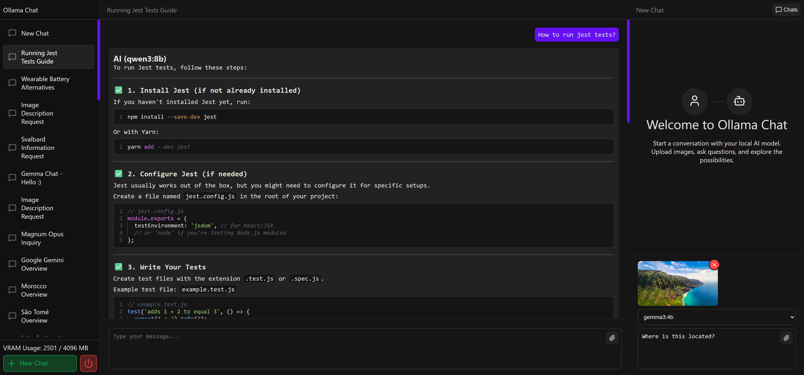

## Preview

### TODOS
- Increase prompt input height relative to prompt 
- Add attachment property to chats
- Rename chats
- Chat organizing (project)
- Fix image saving in history.
- Possibility of limiting features depending on model capabilities. e.g. image or more and even file types if possible. 
- Route to manage models and get new models from Ollama. 
- Far into future - Add user accounts and save chats per user.